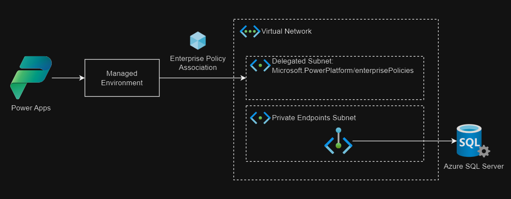

# Power Apps VNET integration with Azure

Accessing Azure SQL Server from Power Apps with [VNET support][1] without the requirement for a gateway.



## Requirements

- Power Apps license (E.g.: Power Apps Premium)
- Use [managed environments][1]. Make sure to enable it after the environment creation.

Follow the steps in the [setup guidelines][2], such as registering the `Microsoft.PowerPlatform` provider.

## Infrastructure

Identify the IP address that will be administering the resources:

```sh
curl ifconfig.me
```

Create the `.auto.tfvars` file:

```sh
cp config/template.tfvars .auto.tfvars
```

Set the required variables:

```terraform
subscription_id    = "<subscriptionId>"
allowed_public_ips = ["<your ip>"]
```

Create the resources:

```sh
terraform init
terraform apply -auto-approve
```

## Setup

Follow the configuration steps described at [Set up Virtual Network support for Power Platform][1].

Among the required configuration steps, the [7. Set Subnet Injection for an environment][4] configuration is essential.


[1]: https://learn.microsoft.com/en-in/power-platform/admin/vnet-support-overview
[2]: https://learn.microsoft.com/en-in/power-platform/admin/vnet-support-setup-configure
[3]: https://learn.microsoft.com/en-in/power-platform/admin/managed-environment-overview
[4]: https://github.com/microsoft/PowerApps-Samples/tree/master/powershell/enterprisePolicies#7-set-subnet-injection-for-an-environment
