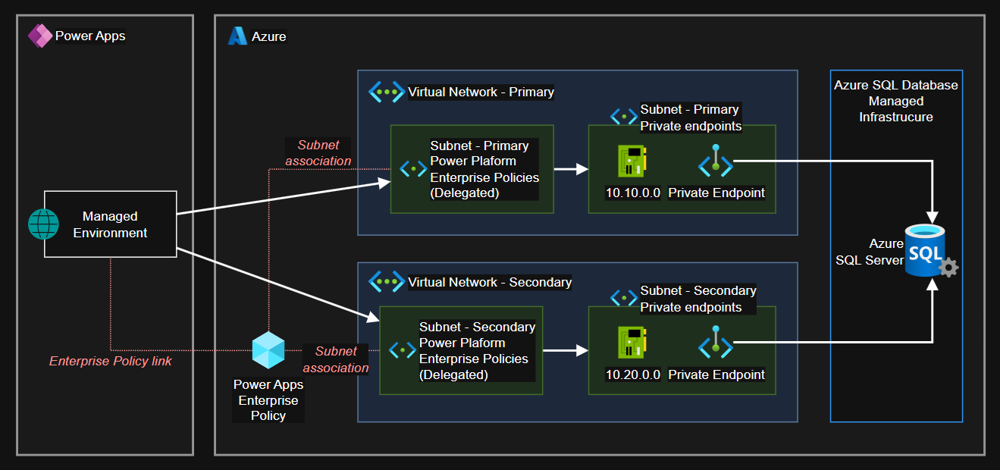

# Power Apps Virtual Network integration

Enabling private network RFC 1918 connectivity from Power Apps managed environments to Azure SQL Server using [Virtual Network support][1], a native alternative to using data gateways.



## Infrastructure

### Requirements

> [!NOTE]
> A license that allows that enables self-service sign-up and managed environments is required.

- A Power Apps license (E.g.: Power Apps Premium, Power Apps Developer). 
- Use [managed environments][1]. Make sure to enable it after the environment creation.
- Azure subscription with `Microsoft.PowerPlatform` provider enabled.

### Deployment

Create the `.auto.tfvars` file:

```sh
cp config/local.auto.tfvars .auto.tfvars
```

Identify the IP address from which you'll be administering the resources:

```sh
curl ifconfig.me
```

Set the required variables to your preferences:

> [!IMPORTANT]
> Make sure to match the Azure and the Power Apps locations to your environment.

```terraform
subscription_id       = "<SUBSCRIPTION id>"
allowed_public_ips    = ["<YOUR IP ADDRESS>"]
entraid_tenant_domain = "<ENTRA ID DOMAIN>"
```

Create the resources:

```sh
terraform init
terraform apply -auto-approve
```

## Setup

In the new Power App UI experience, the Enterprise Policies seem to have been migrated to the URL below, and are identified as `Virtual Network policies`:

```
https://admin.powerplatform.microsoft.com/security/dataprotection
```

Enterprise policy for network injection must be configured via the CLI (or so it seems). Microsoft has provided a [collection os scripts](https://learn.microsoft.com/en-us/power-platform/admin/vnet-support-setup-configure) to assist with that, of which the step [7. Set Subnet Injection for an environment](https://github.com/microsoft/PowerApps-Samples/tree/master/powershell/enterprisePolicies#7-set-subnet-injection-for-an-environment) would be the one required for this configuration.

Download the `microsoft/PowerApps-Samples` code base. Start by reading the [How to run setup scripts](https://github.com/microsoft/PowerApps-Samples/blob/master/powershell/enterprisePolicies/README.md#how-to-run-setup-scripts) section and make sure the requirements are met.

> [!TIP]
> I had issues running these scripts on Linux. Code in this section was run on a Windows environment with PS7.

> [!NOTE]
> Run this script from a elevated terminal. It`ll install several required packages. **Bypass the execution at your own discretion**.

```ps1
cd .\PowerApps-Samples-master\powershell\enterprisePolicies

pwsh -executionpolicy bypass -file .\InstallPowerAppsCmdlets.ps1
```

> [!TIP]
> Close the elevated terminal and start a standard one

Execute the required script that will perform the subnet injection into the Power Apps environment:

```ps1
# You'll need to `cd` into this directory first:
cd .\SubnetInjection\

# And then run the script
pwsh -executionpolicy bypass -file .\NewSubnetInjection.ps1
```

Retrieve the registration status of the enterprise policy to the environment:

> [!NOTE]
> It might take some time until the connectivity is functional and usable when connecting to data from Power Apps.

```ps1
pwsh -executionpolicy bypass -file GetSubnetInjectionEnterprisePolicyForEnvironment.ps1
```

Check the environment history to confirm the change was successful:


## Reference documentation

Quick links to relevant Microsoft documents:

- [Set up Virtual Network support for Power Platform](https://learn.microsoft.com/en-us/power-platform/admin/vnet-support-setup-configure)
- [Virtual Network support overview](https://learn.microsoft.com/en-in/power-platform/admin/vnet-support-overview)
- [7. Set Subnet Injection for an environment](https://github.com/microsoft/PowerApps-Samples/tree/master/powershell/enterprisePolicies#7-set-subnet-injection-for-an-environment)
- [Managed Environments overview](https://learn.microsoft.com/en-in/power-platform/admin/managed-environment-overview)

## 🧹 Clean-up

Remove the subnet injection:

```ps1
pwsh -executionpolicy bypass -file RevertSubnetInjection.ps1.ps1
```

You should now be able to delete the Power App managed environment.

Destroy the Azure resources:

```sh
terraform destroy -auto-approve
```
